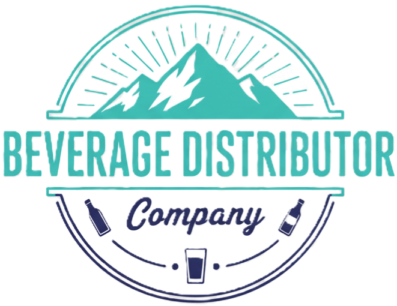
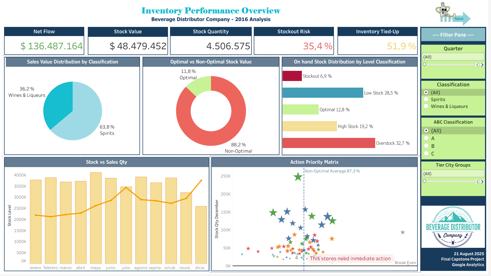
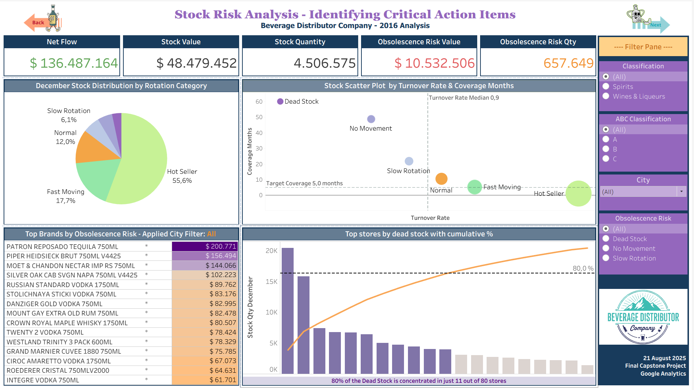
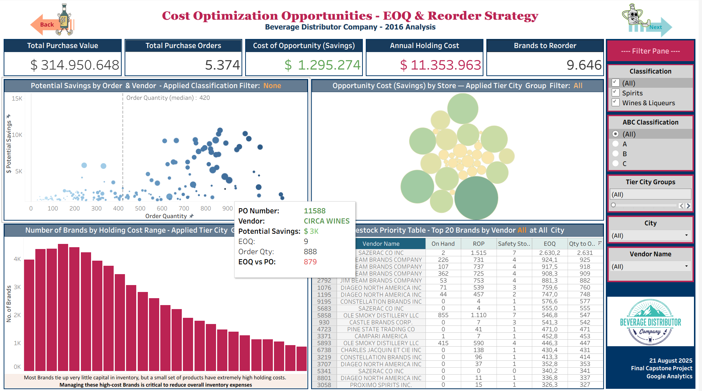
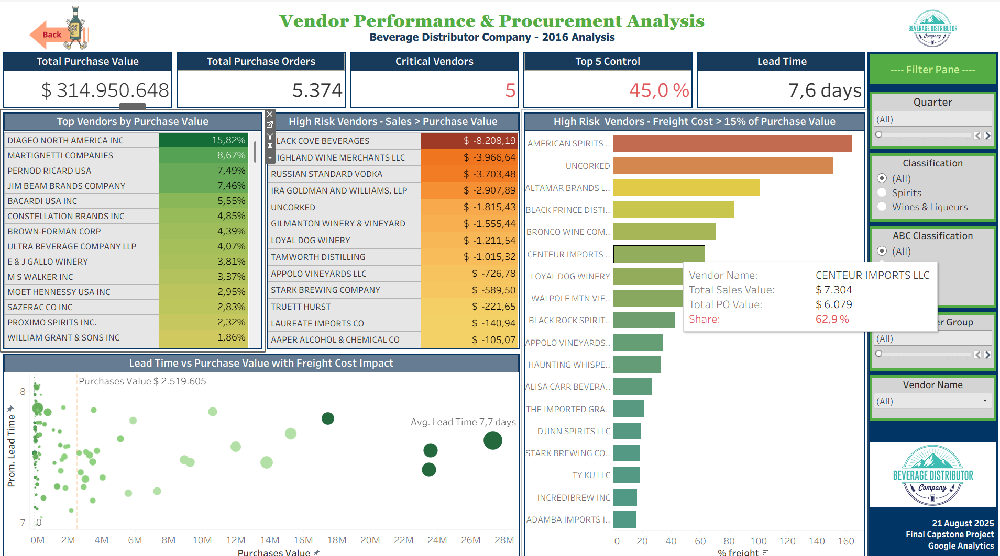

# 📊Beverage Distributor Inventory Analysis 
## ⭐Google Data Analytics Capstone Project 
 
 
 
 
 
--- 
## ✨Executive Summary 
 
**End-to-end inventory optimization analysis for a UK beverage distributor managing 275,000+ SKUs across 80 retail locations.** 
 
### Key Business Impact 
- **$28.8M** in excess working capital identified 
- **78.4%** of inventory requires management intervention 
- **1,39% ROI** potential from recommended optimizations 
- **27,997** Class A SKUs at stockout risk 
 
### Technical Achievement 
Complete data pipeline from 12.8M transaction records to executive dashboards: 
- Multi-language ETL (Python + R) 
- Advanced inventory analytics (ABC classification, EOQ, turnover analysis) 
- Interactive Tableau dashboards for strategic decision-making 
 
**[View Live Dashboards](https://public.tableau.com/app/profile/elena.sanchez.laulhe)** | **[Full Report](Documents/Google_Capstone_Report_15-08-25.pdf)** 
 
--- 

## ✨Project Journey 

- **Ask:** Defined business case (inventory optimization).  
- **Prepare:** Cleaned datasets, standardised variables, removed duplicates.  
- **Process:** Built master tables (purchases, sales, inventory).  
- **Analyse:** Generated KPIs (coverage, turnover, ABC, vendor score).  
- **Share:** Created 4 Tableau dashboards.  
- **Act:** Recommendations for reducing excess and mitigating stockouts.

---

## 📂 Repository Structure
/
├─ Scripts/ # R + Python scripts
├─ Documents/ # Reports
├─ Images/ # Dashboard thumbnails
├─ Data/
├─ README.md
└─ LICENSE
 
### Business Challenge 
A UK beverage distributor faced a **critical inventory management crisis**: 
- Widespread stockouts affecting customer satisfaction 
- Excessive inventory accumulation tying up working capital 
- No systematic approach to inventory optimization 
- 80 retail locations with inconsistent stock management 
 
### Technical Challenge & Recovery 
**The Reality of Data Projects:** This project included a complete restart of Phase 3 due to over-complex architecture. 
 
**What went wrong:** Initial approach used 6+ dimension tables creating calculation inconsistencies. 
 
**The solution:** Simplified to 3 core tables (inventory dimension, sales transactions, purchase orders) enabling reliable analysis. 
 
**Key learning:** Sometimes the best technical decision is to restart with a better architecture. 
 
### Final Solution 
Data-driven optimization framework delivering: 
- **Immediate actions** for 35.4% of SKUs at stockout risk 
- **Working capital recovery** from $28.8M excess inventory 
- **Strategic procurement** improvements with vendor analysis 
- **Automated monitoring** through executive dashboards 
 
--- 
## ✨Visual Identity & Branding 
 

 
### Dashboard Navigation Elements 
 
 
**Professional branding elements designed for this project using Canva, emphasizing quality, freshness, and reliability through natural mountain imagery combined with beverage iconography.** 
 
**Design Tools:** Logo and navigation elements created with **Canva Pro** to maintain visual consistency across all project deliverables. 
 
--- 
## ✨Interactive Dashboards 
 
**[Access All Dashboards Here](https://public.tableau.com/app/profile/elena.sanchez.laulhe)** 
 
### Dashboard 1: Executive Overview 
 
**Key Insights:** $48.5M total inventory value, 35.4% stockout risk, optimal vs non-optimal distribution 
 
### Dashboard 2: Risk Analysis 
 
**Key Insights:** $10.5M obsolescence risk, dead stock concentration analysis, geographic risk distribution 
 
### Dashboard 3: Cost Optimization 
 
**Key Insights:** $1.3M savings opportunity, EOQ calculations, vendor performance optimization 
 
### Dashboard 4: Vendor Analysis 
 
**Key Insights:** $315M procurement spend, vendor concentration risk, lead time optimization 
 
--- 
## ✨Methodology & Technical Implementation 
 
### Data Processing Pipeline 
**1. Data Preparation (Python)** 
- Handled 12.8M sales records using chunking strategy 
- Split massive datasets for memory-efficient processing 
 
**2. Data Cleaning & Processing (R)** 
- Resolved vendor name inconsistencies across 128 suppliers 
- Geographic data standardization and validation 
- Composite key reconstruction (Store + City + Brand) 
- Data quality improvements: zero duplicates, complete referential integrity 
 
**3. Advanced Analytics (R)** 
- ABC Classification: Identified top 26.8% of SKUs driving 80% of sales value 
- Inventory turnover analysis with risk categorization 
- EOQ calculations for cost optimization 
- Coverage analysis: months of demand vs actual stock levels 
 
**4. Business Intelligence (Tableau)** 
- Executive dashboards with drill-down capability 
- Interactive filters: Classification, ABC class, Geographic analysis 
- Risk visualization with color-coded priority systems 
- Mobile-responsive design for field management 
 
### Key Technical Skills Demonstrated 
- **Data Architecture:** Recovery from failed initial approach, simplified star schema design 
- **Multi-language Integration:** Python for data prep, R for analysis, Tableau for visualization 
- **Business Translation:** Converting technical insights into financial impact ($28.8M identified) 
- **Quality Assurance:** Referential integrity validation, automated error checking 
- **Problem Solving:** Systematic approach to vendor mismatches, geographic inconsistencies 
 
--- 
## ✨Key Findings & Recommendations 
 
### Critical Business Insights 
| Metric | Current State | Business Impact | 
|--------|--------------|----------------| 
| **Inventory at Risk** | 78.4% non-optimal | $28.8M excess working capital | 
| **Stockout Risk** | 35.4% of portfolio | Revenue protection priority | 
| **Dead Stock** | 657,649 units | $10.5M liquidation opportunity | 
| **Vendor Concentration** | Top 5 control 45% | Supply chain risk mitigation needed | 
| **Lead Time Variance** | 7.6 days average | Procurement optimization potential | 
 
### Immediate Action Plan 
**0-30 Days (Revenue Protection)** 
- Emergency replenishment for 27,997 Class A SKUs at stockout risk 
- Liquidation campaigns for $4.0M in dead stock 
 
**3-12 Months (Process Optimization)** 
- Implement ABC-based inventory policies 
- Deploy EOQ calculations for top 200 SKUs 
- Vendor performance improvement programs 
 
**12-24 Months (Strategic Excellence)** 
- Predictive analytics for demand forecasting 
- Automated replenishment systems 
- Working capital optimization: 35%% reduction target 
 
--- 
## ✨Project Impact & Growth 
 
### Personal Learning Journey 
This project represents 5 months of intensive learning and problem-solving: 
 
**The Restart Moment** 
- **Challenge:** Phase 3 architectural failure after 2+ weeks of work 
- **Decision:** Complete restart with simplified, robust design 
- **Result:** Better final solution and invaluable resilience learning 
 
**Skills Developed** 
- **Technical Resilience:** Recovery from major setbacks 
- **Business Translation:** Converting 12.8M records into $28.8M insights 
- **Multi-tool Mastery:** Seamless Python-R-Tableau integration 
- **Professional Documentation:** Executive-ready reports and dashboards 
 
### Next Steps & Future Development 
- **Advanced Analytics:** Machine learning for demand forecasting 
- **Real-time Monitoring:** Automated alert systems for inventory risks 
- **Supply Chain Optimization:** End-to-end logistics analysis 
- **Continued Learning:** SQL, Power BI, and advanced statistical modeling 
 
--- 
## ✨Acknowledgments & Contact 
 
### A Journey of Collaboration 
This project was developed as part of the **Google Data Analytics Professional Certificate Program** and represents the culmination of intensive learning and real-world problem-solving. 
 
The restart in Phase 3, the architectural decisions, and the final business insights all emerged through iterative collaboration, demonstrating that the best analytics solutions come from asking the right questions and being willing to start over when necessary. 

--- 
## ⚖️ Data Ethics & Licenses

Code License: MIT License

Data License: [Apache License 2.0](https://www.apache.org/licenses/LICENSE-2.0)
Original Kaggle dataset: [Inventory Analysis Case Study by author name](https://www.kaggle.com/datasets/bhanupratapbiswas/inventory-analysis-case-study)
Ethics: This project is for academic purposes only. Data was anonymised and assumptions were made; results should not be used for production decisions.

---

### Let's Connect

**Elena Sanchez-Laulhe** 
- **GitHub:** [@esanchezlaulhe1312](https://github.com/esanchezlaulhe1312) 
- **Tableau Public:** [Portfolio](https://public.tableau.com/app/profile/elena.sanchez.laulhe) 
- **LinkedIn:** [esanchezlaulhe](www.linkedin.com/in/elena-sanchez-laulhe)
- **Kaggle:** [esanchezlaulh](https://www.kaggle.com/elenasnchezlaulh)
 
 --- 
 
